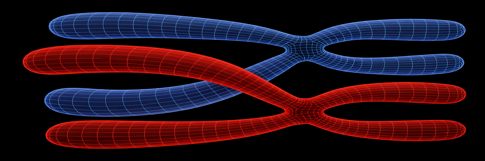
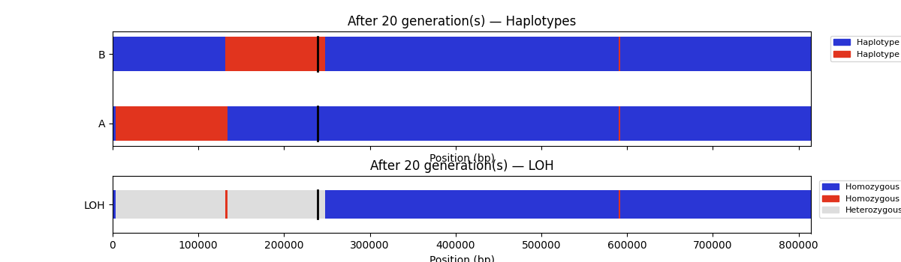

# simRec

_version 0.10_



A Python simulation of mitotic recombination and loss of heterozygosity (LOH) in a diploid yeast chromosome. Models a complete cell cycle — replication, inter-homolog recombination, segregation, and selection — and produces linear haplotype and LOH maps of the resulting genome state.

---

## Overview

simRec simulates mitotic recombination and LOH in a diploid yeast chromosome across multiple generations. Each generation models a complete cell cycle: replication of both parental homologs into sister chromatid pairs, inter-homolog recombination via gene conversion with or without crossover, centromere-linked segregation into two daughter cells, and random selection of one daughter to seed the next generation. The resulting haplotype state is analyzed post-hoc using rules that mirror the interpretation of experimental LOH data, classifying observed LOH intervals as gene conversion non-crossover events (GC-NCO), gene conversion crossover events (GC-CO), or terminal crossovers (CO-terminal).

---

## Features

- Diploid chromosome representation using compact run-length encoded interval tuples
- Symmetric inter-homolog gene conversion — either homolog can initiate
- Configurable crossover probability per event (`--co-nco`, default 0.5)
- Configurable gene conversion tract size
- Poisson-distributed recombination events per generation
- Centromere-protected interval (GC placement disallowed at CEN)
- GC tracts clipped to chromosome ends
- Centromere-linked segregation mimicking random assortment
- Post-hoc LOH classification: GC-NCO, GC-CO, CO-terminal, and DCO events
- Phase-aware crossover detection from haplotype identity
- Size-aware classification: blocks exceeding `--gc-max` classified as DCO or flagged complex
- Terminal cluster heuristic reclassification via `reclassify_terminal_clusters`
- Adjacent-to-terminal flagging for LOH clusters near telomeres
- True event logging (`--log-events`) with per-generation haplotype snapshots
- Combined haplotype + LOH visualization
- Tab-separated event output for scripting and batch runs (`--events`, `--events-nh`)
- Batch runner (`simRec_batch.py`) for large-scale multi-cell simulations
- Reproducible runs via random seed
- Dependencies beyond the standard library: `matplotlib`, `tqdm` (batch runner only)

---

## Requirements

- Python ≥ 3.9
- `matplotlib`
- `tqdm` (batch runner only)

```bash
pip install matplotlib tqdm
```

---

## Installation

No installation required. Clone or download the repository and run directly:

```bash
git clone https://github.com/yourlab/simRec.git
cd simRec
```

---

## Input format

A CSV file with three columns specifying the chromosome name, length in bp, and centromere midpoint position:

```
chromosome, length, CEN
I, 500000, 150200
```

In single-chromosome mode (current default), only the first row is used. An example input file is provided as `genome_chrI.csv`.

---

## Usage

### Command line

```bash
python simRec.py genome_chrI.csv [options]
```

| Argument | Type | Default | Description |
|---|---|---|---|
| `genome_file` | positional | — | Path to genome CSV |
| `--n-gen` | int | `10` | Number of generations to simulate |
| `--p-rec` | float | `1e-5` | Base recombination probability per bp per generation |
| `--gc-min` | int | `100` | Minimum gene conversion tract size (bp) |
| `--gc-max` | int | `5000` | Maximum gene conversion tract size (bp) |
| `--co-nco` | float | `0.5` | Crossover probability per recombination event (0 = all NCO, 1 = all CO) |
| `--seed` | int | `None` | Random seed for reproducibility |
| `--plot` | flag | off | Display combined haplotype + LOH plot interactively |
| `--plot-out` | str | `None` | Save plot to file (PNG or PDF) instead of displaying |
| `--events` | flag | off | Output classified events as tab-separated table with header |
| `--events-nh` | flag | off | Output classified events as tab-separated table without header (for appending runs) |
| `--log-events` | str | `None` | Write true mechanical events to FILE as CSV; also writes `haplotype.txt` alongside |
| `--version` | flag | — | Print version and exit |

### Examples

Run 20 generations at elevated recombination rate with a fixed seed:

```bash
python simRec.py genome_chrI.csv --n-gen 20 --p-rec 1e-4 --seed 42
```

Run and save a plot:

```bash
python simRec.py genome_chrI.csv --n-gen 20 --p-rec 1e-4 --seed 42 --plot-out results.png
```

Output classified events as a tab-separated table:

```bash
python simRec.py genome_chrI.csv --n-gen 20 --p-rec 1e-5 --events
```

Accumulate multiple runs into a single file:

```bash
# First run — write header
python simRec.py genome_chrI.csv --n-gen 20 --p-rec 1e-5 --events > results.tsv

# Subsequent runs — append without header
for i in $(seq 2 100); do
    python simRec.py genome_chrI.csv --n-gen 20 --p-rec 1e-5 --events-nh >> results.tsv
done
```

`--events` and `--plot` can be combined to produce a table and a figure in the same run.

### Example output

```
Loaded chromosome 'I', length 500000 bp
Running 20 generation(s)...

Final haplotype state:
  Homolog A:
         1 –     4285  [B]
      4286 –     8059  [A]
      8060 –     8630  [B]
         ...

LOH state:
         1 –     4285  [B]
      4286 –     8059  [A]
      8060 –     8630  [het]
         ...

Classified events:
  GC-CO            24586 –    29152  [B]  left=het  right=het
  GC-NCO          155801 –   156838  [B]  left=het  right=het
  GC-CO           257089 –   296076  [A]  left=het  right=B  [adjacent-to-terminal]
  GC-NCO          296077 –   296229  [B]  left=A  right=A  [adjacent-to-terminal]
  CO-terminal     313996 –   500000  [B]  left=A  right=tel

Reclassified events:
  GC-CO            24586 –    29152  [B]  left=het  right=het
  GC-NCO          155801 –   156838  [B]  left=het  right=het
  CO-terminal     257089 –   296076  [A]  left=het  right=B  [adjacent-to-terminal, reclassified]
  GC-NCO          296077 –   296229  [B]  left=A  right=A  [adjacent-to-terminal, reclassified]
  CO-terminal     313996 –   500000  [B]  left=A  right=tel  [reclassified]
```

---

## Visualization

The `--plot` / `--plot-out` flags produce a two-panel figure:

- **Top panel — Haplotype map:** one bar per homolog (A and B), colored by parental identity at each position. The centromere is marked with a vertical black tick.
- **Bottom panel — LOH map:** a single bar showing genomic intervals that are homozygous (LOH-A in blue, LOH-B in red) or heterozygous (light grey).



---

## Python API

The simulation can be driven programmatically without the CLI:

```python
from simRec import (load_genome, run_simulation, plot_cell_and_loh,
                    compute_loh, classify_events, reclassify_terminal_clusters)

# Load genome from file
genome = load_genome("genome_chrI.csv", p_rec_default=1e-4)

# Run simulation — returns final cell, event log, and haplotype snapshots
final_cell, event_log, haplotype_snapshots = run_simulation(
    genome, n_gen=20, gc_min=100, gc_max=5000, co_prob=0.5)

# Inspect LOH state
for start, end, state in compute_loh(final_cell):
    print(f"{start:>8} – {end:>8}  [{state}]")

# Classify recombination events (gc_max used for DCO detection)
events = classify_events(final_cell, gc_max=5000)
for event in events:
    print(event)

# Apply terminal cluster heuristic reclassification
for event in reclassify_terminal_clusters(events, gc_max=5000):
    print(event)

# Inspect the true mechanical event log
for entry in event_log:
    print(entry)   # keys: gen, chrom, type ("GC" or "CO"), start, end

# Plot
plot_cell_and_loh(final_cell, title="20 generations", savepath="out.png")
```

Individual cycle steps are also importable for experimentation:

```python
from simRec import (
    replicate_cell,   # S phase: duplicate homologs into sister chromatid pairs
    recombine,        # recombination: GC ± crossover on post-replication cell
    segregate,        # segregation: split into two daughter cells
    select,           # selection: randomly choose one daughter
)
```

---

## Data structures

### Chromosome object

A chromosome is a `dict` with the following slots. All interval data are stored as lists of `(start, end, value)` tuples (1-based, inclusive coordinates):

| Slot | Type | Description |
|---|---|---|
| `name` | `str` | Chromosome name (e.g. `"I"`) |
| `length` | `int` | Chromosome length in bp |
| `position` | `[(int, int, None)]` | Fixed span; scalar metadata |
| `cen` | `[(int, int, None)]` | Centromere interval; protected from GC placement |
| `p_rec` | `[(int, int, float)]` | Recombination probability per bp; supports sub-intervals for hotspots |
| `haplotype` | `[(int, int, str)]` | Parental identity per interval; values `"A"` or `"B"` |

After a gene conversion without crossover, a haplotype slot might look like:

```python
[(1, 100000, "A"), (100001, 100100, "B"), (100101, 500000, "A")]
```

### Cell objects

**Pre-replication / post-segregation:**
```python
cell = {"A": chr_A, "B": chr_B}
```

**Post-replication (during recombination):**
```python
cell = {
    "A": [chrA1, chrA2],   # sister chromatid pair from homolog A
    "B": [chrB1, chrB2],   # sister chromatid pair from homolog B
}
```

### Event records

`classify_events` returns a list of dicts, one per detected LOH event:

| Field | Type | Values | Description |
|---|---|---|---|
| `type` | `str` | `GC-NCO`, `GC-CO`, `CO-terminal`, `DCO` | Event classification |
| `start` | `int` | — | First bp of LOH block |
| `end` | `int` | — | Last bp of LOH block |
| `haplotype` | `str` | `A`, `B` | Haplotype identity of the LOH block |
| `flanking_left` | `str` | `A`, `B`, `het`, `tel` | LOH state of the immediately adjacent segment to the left |
| `flanking_right` | `str` | `A`, `B`, `het`, `tel` | LOH state of the immediately adjacent segment to the right |
| `adjacent_to_terminal` | `bool` | — | True if the block's immediate LOH neighbor is a non-het LOH block |
| `complex` | `bool` | — | True if the block could not be cleanly classified (present only when applicable) |

`reclassify_terminal_clusters` returns the same structure with additional fields:

| Field | Type | Description |
|---|---|---|
| `reclassified` | `bool` | True if the heuristic changed or merged this record |
| `complex` | `bool` | True if flanking haplotypes differed and the block could not be resolved |

### True event log

`run_simulation` returns an `event_log` — the ground-truth mechanical events — as a list of dicts:

| Field | Values | Description |
|---|---|---|
| `gen` | int | Generation number (1-based) |
| `chrom` | str | Chromosome name |
| `type` | `GC`, `CO` | Gene conversion only, or gene conversion with crossover |
| `start` | int | GC tract start position |
| `end` | int | GC tract end position |

---

## Recombination model

Each generation proceeds as follows:

1. **Replication** — each homolog is duplicated into a sister chromatid pair, producing four chromatids total.
2. **Recombination** — the number of events is drawn from a Poisson distribution with λ = `p-rec` × chromosome length. For each event:
   - Either homolog is chosen at random as the initiator; the other donates (symmetric initiation).
   - A gene conversion (GC) site is sampled from non-CEN sequence, weighted by the `p_rec` slot.
   - GC tract size is drawn uniformly from [`gc-min`, `gc-max`] bp, centered on the site, clipped to chromosome ends, and rejected if it overlaps the centromere.
   - The GC tract is copied from the donor chromatid into the initiating chromatid.
   - With probability `--co-nco` (default 0.5), a crossover occurs: the telomere-distal arm relative to the GC tract is swapped between the two chromatids.
3. **Segregation** — one chromatid from each sister pair is assigned to each daughter cell (centromere-linked, independent per homolog pair).
4. **Selection** — one daughter is chosen at random to seed the next generation.

### LOH classification

Post-hoc classification of the final haplotype state mirrors experimental LOH interpretation:

- **GC-NCO** — internal LOH block ≤ `gc-max` where homolog A has the same haplotype identity on both sides (no phase switch).
- **GC-CO** — internal LOH block ≤ `gc-max` where homolog A switches haplotype identity across the block, indicating an associated crossover.
- **DCO** — internal LOH block > `gc-max` flanked by het on both sides. Too large to be a gene conversion; interpreted as a double crossover bracketing the region.
- **CO-terminal** — LOH block extending to a telomere. Multiple abutting terminal blocks on the same arm are each reported separately.
- **Adjacent-to-terminal** — internal events whose immediate LOH neighbor is a non-het block are flagged, indicating interpretation ambiguity.
- **complex** — blocks that cannot be cleanly resolved (e.g. oversized blocks with LOH neighbors rather than het).

### Terminal cluster reclassification

`reclassify_terminal_clusters(events, gc_max)` applies a heuristic to contiguous terminal LOH clusters:

- **Two-block clusters** — both blocks called CO-terminal.
- **Three-or-more block clusters** — interior blocks ≤ `gc_max` flanked by same-haplotype LOH on both sides are extracted as GC-NCO; remaining blocks are merged into CO-terminal records where the haplotype is consistent. Blocks with mismatched flanking haplotypes are tagged `complex`.

---

## Testing

```bash
pip install pytest
pytest test_simRec.py -v
```

45 tests covering interval helpers, GC placement and CEN exclusion, gene conversion, crossover directionality, replication independence, segregation correctness, LOH computation, event classification (including DCO and CO probability), and end-to-end simulation integrity.

---

## Batch runner

`simRec_batch.py` runs many independent cell lineages and accumulates classified events into a single tab-separated file. Output is identical in format to `--events` with an additional `cell` column.

```bash
python simRec_batch.py genome_chrII.csv [options]
```

| Argument | Type | Default | Description |
|---|---|---|---|
| `genome_file` | positional | — | Path to genome CSV |
| `--n-cells` | int | `1000` | Number of independent cell lineages |
| `--n-gen` | int | `5000` | Generations per cell |
| `--p-rec` | float | `3.7e-10` | Recombination probability per bp (Sui et al. 2020 lower bound) |
| `--gc-min` | int | `100` | Minimum GC tract size (bp) |
| `--gc-max` | int | `5000` | Maximum GC tract size (bp) |
| `--co-nco` | float | `0.5` | Crossover probability per event |
| `--seed` | int | `None` | Master random seed |
| `--out` | str | stdout | Output file path; if omitted, writes to stdout |

Output goes to stdout by default (progress bar suppressed) so results can be piped directly into downstream scripts. Specifying `--out` enables the progress bar on stderr.

```bash
# Large batch to file with progress bar
python simRec_batch.py genome_chrII.csv --n-cells 10000 --n-gen 5000 --seed 1 --out batch.tsv

# Pipe directly into analysis
python simRec_batch.py genome_chrII.csv --n-cells 1000 --n-gen 5000 | Rscript analyze.R
```

---

## Planned extensions

- Multi-chromosome support (all 16 *S. cerevisiae* chromosomes)
- Recombination hotspots via sub-interval `p_rec` segments
- Sister chromatid exchange (SCE) with configurable `P_sister`
- Parent-strain-specific `p_rec` profiles (groundwork laid by symmetric initiation)
- Multiprocessing support in `simRec_batch.py`
- PyRanges backend option for large-scale performance

---

## License

MIT
